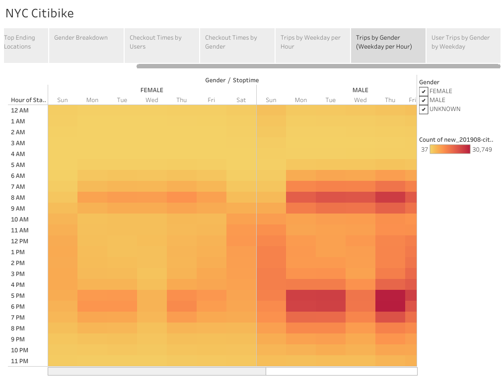

# Bike Sharing NYC Citibike

[Link to Tableau](https://public.tableau.com/app/profile/sean.engel3411)

## Project Overview:

The purpose of this tableau visualization and analysis was ton share information with key stakeholders that a bike-sharing program in Des Moines is a strong investment. This analysis was performed using Jupyter Notebook, Pandas, and Tableau.

## Results:

The Citibike data provided for August of 2019 shows that the total number of trips are 2,344,224.

Of the total number of trips, the gender breakdown is shown in the pie chart below. Majority of the business is male dominated making up well over 50% of total rides.

When analyzing the start map (blue) with the top stop map (red), we can see that majority of the rides are localized to one area. Given the rides are relatively close together, we can draw conclusions such as rides are primarily tourists, however, more analysis would need to be done to verify this theory.

The line chart below allows us to filter the graph by hour trip duration. At a closer look, the peak ride time is 5hrs.

Taking the same line graph as previously, but now breaking it out into genders to better understand the demographics of the business, we can see similarily to the pie chart that males are out numbering the other genders in total number of rides and trip duration.

Knowing that repairs are a big piece of this investment, multiple heatmaps showcase the busiest bike share times. Below the fewest number of rides are happening before 5am and the bulk of the rides are between 6am-9am and 4pm-7pm.

Same as the previous heatmap, but also adding another layer including gender specific times. This paints a even clearer picture of when the bikes are being used the most.

And lastly, this heatmap displays all three key information pertaining to where profits are being generated and at what times. We can see that the bulk of the business is coming from males and majority are subscribers. The busiest day is Thursday and the slowest day Sunday.

---

## Conclusion:

After a deep analysis into the CitiBike business in the month of August 2019, it's clear that majority of the business is cominng from male subscribers. Given this information, I would suggest marketing towards males given the company hits their goal in investments from stakeholders to launch the Des Moines market. I would also take in consideration the busiest times versus the slow times when planning bike repairs and relocations. Thursdays are proving to be the busiest day with Sunday being the slowest. Additional analysis into demographic information such as age and race could be helpful in plans for marketing to the Des Moines area.
